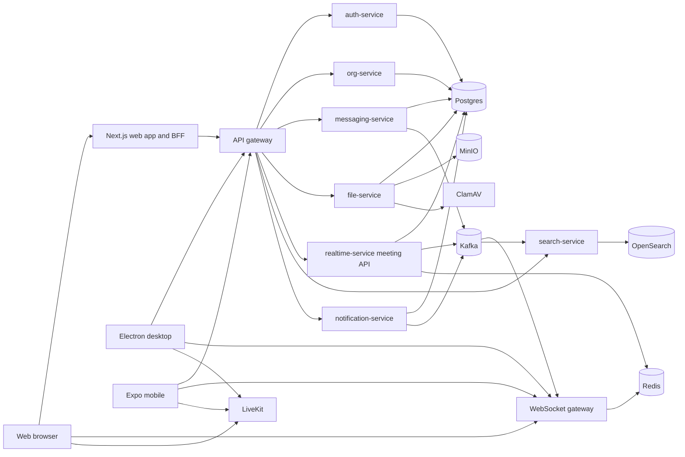

# System Architecture

## Repository Topology

`/Users/mahmud/Projects/aloqa` is a parent directory containing two primary repositories:

- `aloqa-backend`: backend services, API contracts, migrations, deploy files, and service infrastructure.
- `aloqa-frontend`: web, desktop, mobile, shared frontend packages, frontend deployment, and architecture docs.

The parent directory itself is not the main application repository. The child repos are the meaningful source-control units.

Source paths:

- `aloqa-backend/go.work`
- `aloqa-backend/AGENTS.md`
- `aloqa-frontend/package.json`
- `aloqa-frontend/AGENTS.md`

## Runtime Overview

At runtime, Aloqa is a distributed application:

The backend's service list is defined by the Go workspace and local task runner. Source paths:

- `aloqa-backend/go.work`
- `aloqa-backend/Taskfile.yml`

The production compose file includes backend services, infrastructure, frontend, and nginx in one deployment description. Source path: `aloqa-backend/deploy/prod/docker-compose.yml`.

The frontend repo also describes production edge behavior and deployment assumptions. Source paths:

- `aloqa-frontend/docs/infrastructure-architecture.md`
- `aloqa-frontend/deploy/nginx.prod.conf`

## Backend Service Boundaries

The backend workspace contains these modules:

- `api-gateway`: HTTP API gateway for browser and app clients.
- `auth-service`: identity, sessions, verification, OAuth, 2FA, password flows, magic links.
- `org-service`: companies, workspaces, channels, invites, members, roles, ABAC.
- `messaging-service`: channel messages, DMs, reactions, pins, read state, threads, blocks.
- `file-service`: upload, metadata, shares, storage accounting, scanning, processing.
- `notification-service`: email and web notifications, channel mute state.
- `realtime-service`: meeting domain, LiveKit integration, meeting state, room settings, breakout rooms.
- `search-service`: OpenSearch indexing and search.
- `ws-gateway`: WebSocket subscriptions and fanout for chat, notifications, meetings, and presence.
- `platform`: shared runtime libraries, migrations, auth utilities, logging, permissions, middleware.
- `shared`: source contracts for OpenAPI and protobuf.

Source path: `aloqa-backend/go.work`.

## Frontend Boundaries

The frontend monorepo has three application surfaces:

- `apps/web`: Next.js browser app and BFF route handlers.
- `apps/desktop`: Electron desktop shell and renderer.
- `apps/mobile`: Expo/React Native mobile app.

Shared frontend code is split into:

- `packages/core`: headless domain clients, API routes, realtime, state, auth and shared logic.
- `packages/features/*`: feature-level headless or transitional feature packages.
- `packages/ui-kit-*`: platform-specific UI kits.
- `packages/eslint-config`: shared lint policy.

Source paths:

- `aloqa-frontend/apps/`
- `aloqa-frontend/packages/`
- `aloqa-frontend/docs/adr/0023-platform-first-architecture.md`

## Contract Ownership

The backend owns authoritative server contracts:

- HTTP API: `aloqa-backend/shared/api/api-gateway/v1/api-gateway.openapi.yaml`
- HTTP path fragments: `aloqa-backend/shared/api/api-gateway/v1/paths/`
- gRPC APIs: `aloqa-backend/shared/proto/`

Generated code is not the source of truth. The backend repository instructions explicitly say not to read or edit generated code under `shared/pkg` and `shared/bin`. Source path: `aloqa-backend/AGENTS.md`.

The frontend maintains route helpers and client behavior:

- `aloqa-frontend/packages/core/src/api/routes.ts`
- `aloqa-frontend/packages/core/src/api/endpoints.ts`
- `aloqa-frontend/packages/core/src/api/client.ts`

This split is sound, but it requires drift checks because the frontend can reference intended routes before backend OpenAPI catches up, and backend routes can change before frontend helpers are updated.

## Web BFF Architecture

The web app is not intended to expose backend bearer tokens directly to browser JavaScript. ADR-0037 defines a BFF session model:

- User authenticates through web route handlers.
- Backend access/refresh tokens are sealed into an HttpOnly app cookie named `aloqa_bff_session`.
- Browser REST calls hit same-origin `/api/*` route handlers.
- The BFF forwards requests to the backend gateway with backend auth cookies server-side.
- The BFF can refresh stale tokens and re-seal the session.

Source paths:

- `aloqa-frontend/docs/adr/0037-web-bff-backend-session.md`
- `aloqa-frontend/apps/web/app/api/[...path]/route.ts`
- `aloqa-frontend/apps/web/src/lib/auth/sessionCookie.ts`
- `aloqa-frontend/apps/web/src/lib/auth/sessionRefresh.ts`

This design reduces token exposure in the browser. It also makes edge routing critical: browser `/api/*` must reach the Next.js app, not bypass it unintentionally.

## Realtime Architecture

Realtime is split into two major lanes:

1. WebSocket events through `ws-gateway`.
2. Audio/video media through LiveKit.

Chat and meeting state changes are persisted first, then propagated asynchronously through outbox tables and Kafka. The WebSocket gateway consumes Kafka events and fans out to subscribed clients. Redis holds presence, room state, typing state, notification pub/sub, and rate-limit-style ephemeral state.

Source paths:

- `aloqa-backend/messaging-service/`
- `aloqa-backend/realtime-service/`
- `aloqa-backend/ws-gateway/`
- `aloqa-backend/platform/migrations/`
- `aloqa-frontend/packages/core/src/realtime/client.ts`
- `aloqa-frontend/packages/core/src/realtime/events.ts`
- `aloqa-frontend/docs/adr/0022-livekit-client-sdk.md`

## Data Architecture

PostgreSQL is the system of record. Redis is used for cache, session/presence-like fast state, room state, pub/sub, and realtime coordination. MinIO stores files. OpenSearch indexes searchable content. Kafka moves durable events between services.

The database schema is controlled by migrations under `aloqa-backend/platform/migrations/`. The schema is broad and includes:

- identity and sessions
- companies, workspaces, channels, memberships
- custom roles and role permissions
- direct messages and user blocks
- messages, reactions, pins, threads, read cursors
- files, shares, quotas, thumbnails, processing state
- notifications and mutes
- meetings, admins, participants, room settings, device requests
- meeting chat and reactions
- breakout rooms and waiting rooms
- outbox tables for messaging, channels, and meetings

## Deployment Architecture

The backend repo has local and production compose definitions:

- Local/core: `aloqa-backend/deploy/compose/core/docker-compose.yml`
- Production: `aloqa-backend/deploy/prod/docker-compose.yml`
- Backend nginx: `aloqa-backend/deploy/prod/nginx/nginx.conf`

The frontend repo has its own production nginx and CI/CD docs:

- `aloqa-frontend/deploy/nginx.prod.conf`
- `aloqa-frontend/docs/CICD.md`
- `aloqa-frontend/docs/infrastructure-architecture.md`
- `aloqa-frontend/deploy/smoke-live.sh`

There is a deployment ambiguity. The backend nginx routes `/api/v1/` to `api-gateway`; the frontend nginx routes `/api/*` to the web app/BFF. I cannot determine from the codebase which file is the active edge in production.

## System-Level Architectural Assessment

The architecture is coherent for a collaboration product:

- Go services own durable business logic and infrastructure.
- TypeScript clients own platform UX and BFF browser security.
- Kafka/outbox handles asynchronous fanout.
- LiveKit handles media instead of custom WebRTC.
- OpenAPI/protobuf contracts provide integration boundaries.

The main architectural weakness is not the component choice; it is coordination risk across component boundaries. The codebase should prioritize:

- one authoritative production edge model
- automated contract drift checks
- backend integration tests around service boundaries
- versioned realtime event contracts
- migration safety and operational observability
