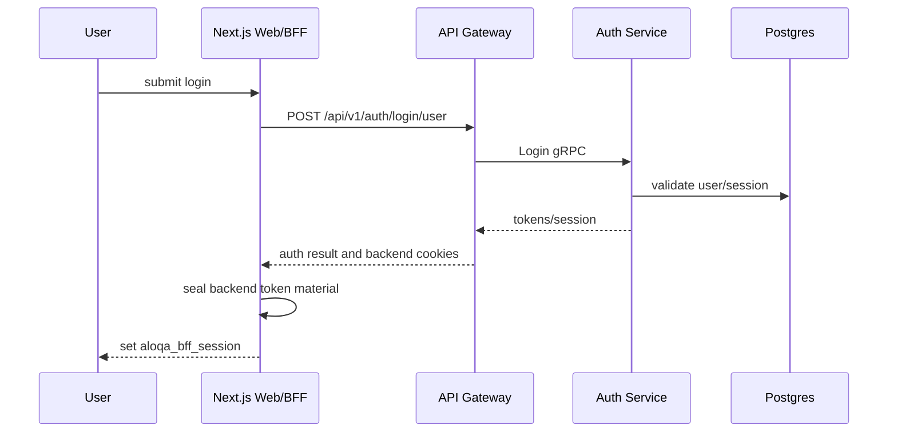
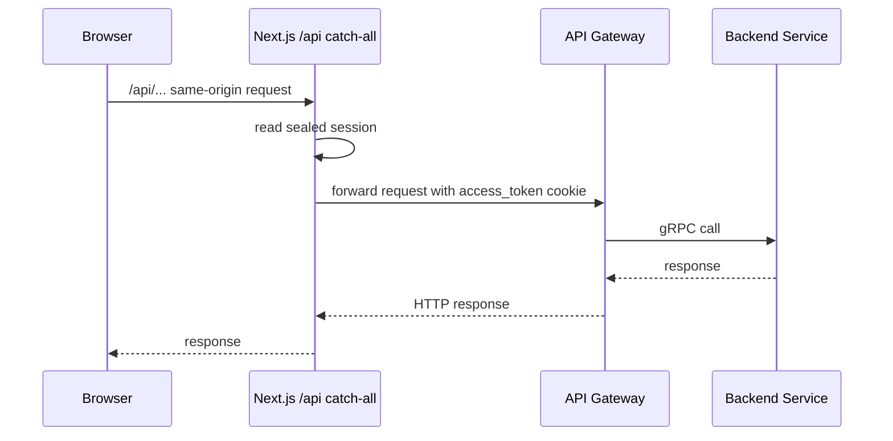
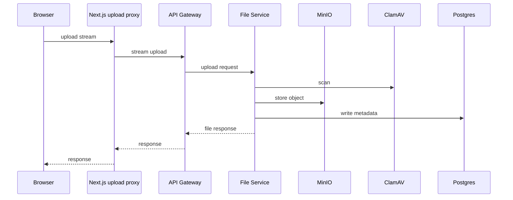
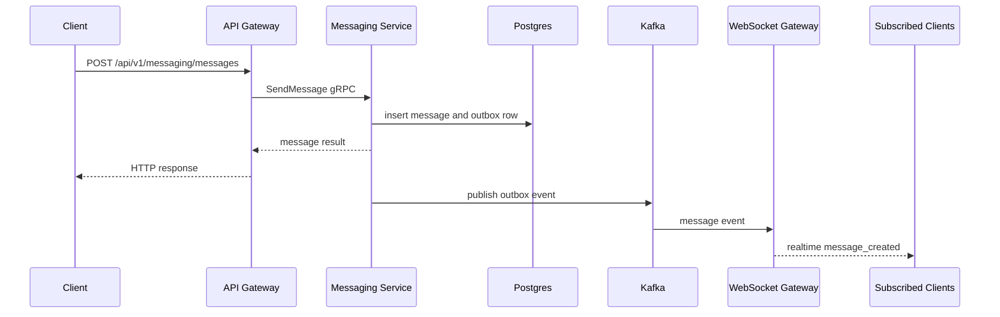
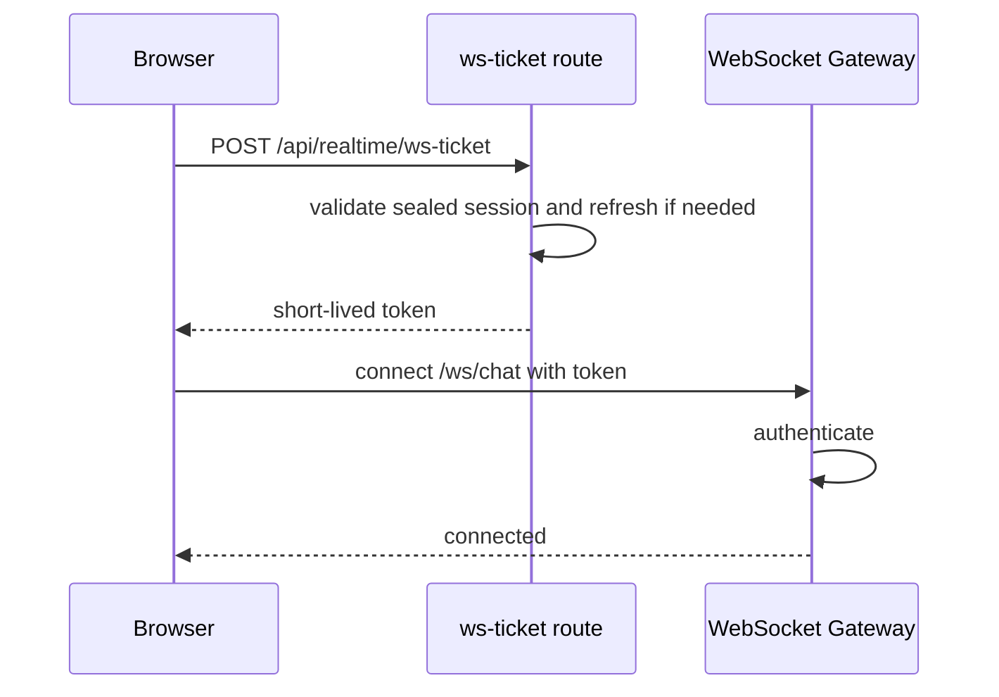
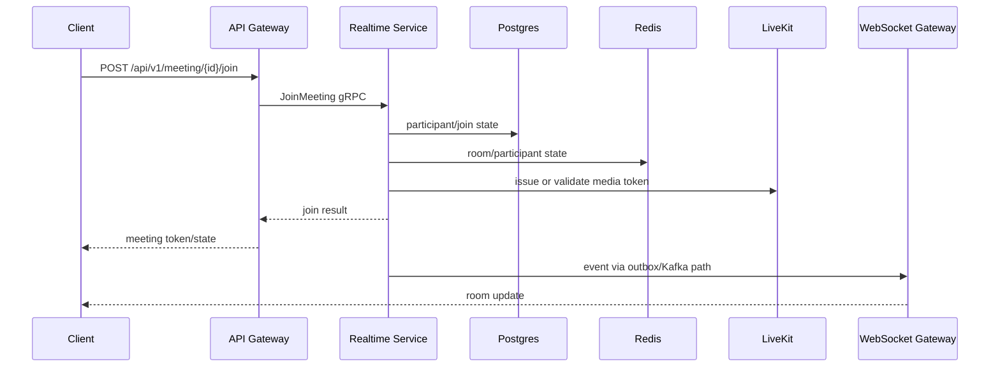
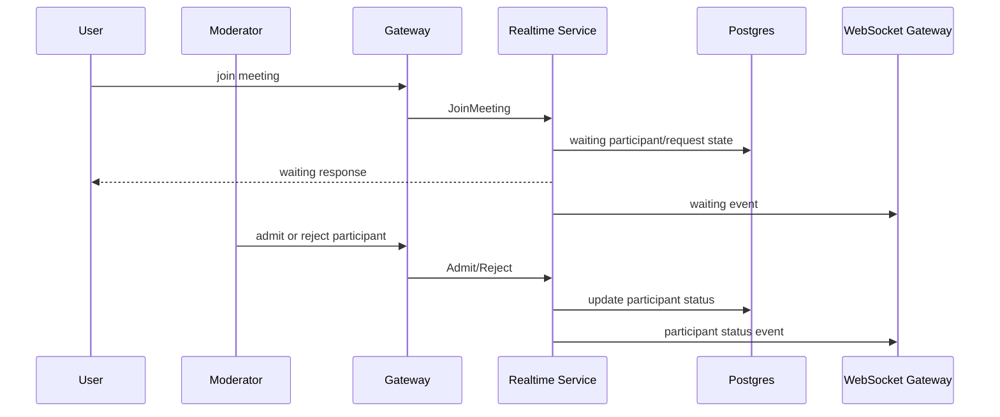
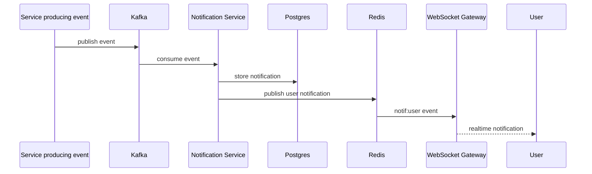
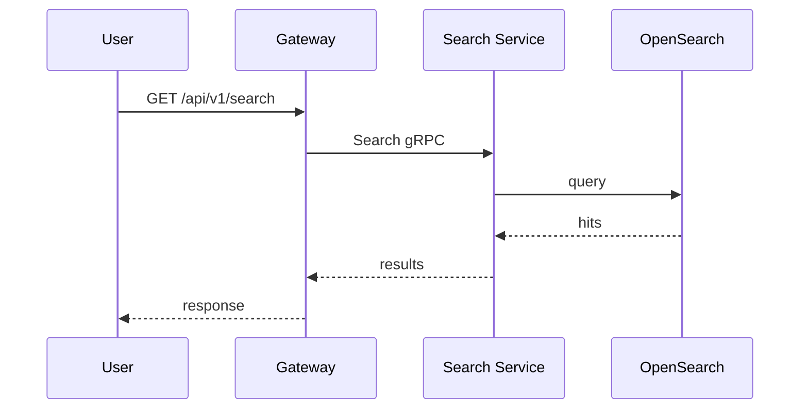
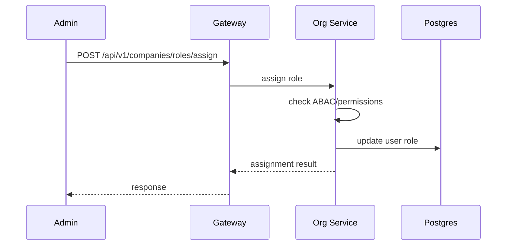

# Request Flows

## Purpose

This document describes important end-to-end flows across frontend, gateway, backend services, persistence, realtime, and infrastructure.

Source paths used throughout:

- `aloqa-frontend/apps/web/app/api/`
- `aloqa-frontend/packages/core/src/api/`
- `aloqa-frontend/packages/core/src/realtime/`
- `aloqa-backend/api-gateway/`
- `aloqa-backend/auth-service/`
- `aloqa-backend/org-service/`
- `aloqa-backend/messaging-service/`
- `aloqa-backend/file-service/`
- `aloqa-backend/realtime-service/`
- `aloqa-backend/ws-gateway/`
- `aloqa-backend/platform/migrations/`

## Web Login Flow

Source paths:

- `aloqa-backend/shared/api/api-gateway/v1/paths/login_user.yaml`
- `aloqa-backend/auth-service/`
- `aloqa-frontend/apps/web/src/lib/auth/sessionCookie.ts`

The exact web route for login UI depends on the app route implementation. The BFF session sealing path is explicit.

## Web BFF REST Request Flow

If the backend returns 401 and the request is replayable, the BFF can refresh and retry. Source paths:

- `aloqa-frontend/apps/web/app/api/[...path]/route.ts`
- `aloqa-frontend/apps/web/src/lib/auth/sessionRefresh.ts`

This flow depends on edge routing sending browser `/api/*` traffic to Next.js.

## Upload Flow

Source paths:

- `aloqa-frontend/apps/web/app/api/upload/[...path]/route.ts`
- `aloqa-backend/shared/api/api-gateway/v1/paths/file/upload_file.yaml`
- `aloqa-backend/file-service/`
- `aloqa-backend/deploy/prod/docker-compose.yml`

Upload uses a separate BFF route because large streams are not safely replayable after a refresh.

## Send Message Flow

Source paths:

- `aloqa-backend/shared/api/api-gateway/v1/paths/messaging/send_message.yaml`
- `aloqa-backend/messaging-service/`
- `aloqa-backend/platform/migrations/20260610000001_messaging_outbox.*`
- `aloqa-backend/ws-gateway/`
- `aloqa-frontend/packages/core/src/realtime/events.ts`

Important correctness requirement: the HTTP success response and realtime event should converge on the same message identity and ordering semantics.

## WebSocket Connection Flow

Source paths:

- `aloqa-frontend/apps/web/app/api/realtime/ws-ticket/route.ts`
- `aloqa-frontend/packages/core/src/realtime/client.ts`
- `aloqa-backend/ws-gateway/`

Desktop and mobile may use direct token adapters rather than the web ticket route.

## Meeting Join Flow

Source paths:

- `aloqa-backend/shared/api/api-gateway/v1/paths/meeting/join_meeting.yaml`
- `aloqa-backend/realtime-service/`
- `aloqa-backend/platform/migrations/20260522150000_add_video_meetings.*`
- `aloqa-frontend/docs/adr/0022-livekit-client-sdk.md`

Exact media token details should be verified in the realtime service implementation before changing client behavior.

## Waiting Room Flow

Source paths:

- `aloqa-backend/shared/api/api-gateway/v1/paths/meeting/list_waiting_participants.yaml`
- `aloqa-backend/shared/api/api-gateway/v1/paths/meeting/admit_participant.yaml`
- `aloqa-backend/shared/api/api-gateway/v1/paths/meeting/reject_participant.yaml`
- `aloqa-backend/platform/migrations/20260624110000_waiting_room.*`

## Notification Flow

Source paths:

- `aloqa-backend/notification-service/`
- `aloqa-backend/ws-gateway/`
- `aloqa-backend/shared/api/api-gateway/v1/paths/notifications/`

## Search Flow

Source paths:

- `aloqa-backend/shared/api/api-gateway/v1/paths/search.yaml`
- `aloqa-backend/search-service/`

Indexing is likely asynchronous through Kafka consumers. Search should be treated as eventually consistent unless tests prove otherwise.

## Role Assignment Flow

Source paths:

- `aloqa-backend/shared/api/api-gateway/v1/paths/assign_company_role.yaml`
- `aloqa-backend/org-service/internal/core/abac/`
- `aloqa-backend/platform/migrations/20260604000001_custom_roles_v2.*`

## Request Flow Risks

### Replay Safety

Normal BFF requests can be retried after refresh; upload streams cannot. That split is explicit in web routes. Source paths:

- `aloqa-frontend/apps/web/app/api/[...path]/route.ts`
- `aloqa-frontend/apps/web/app/api/upload/[...path]/route.ts`

### Eventual Consistency

Message search, notification delivery, and realtime fanout can lag behind database writes. Product UX should account for that.

### Multi-Path Auth

Web, desktop, and mobile may not use identical token flows. A bug can affect one platform only.

### Deployment Routing

The web BFF request flow only works if edge routing is configured correctly.

## Flow Assessment

The request flows are coherent and match the architecture of a collaboration product. The main risk is that many workflows are cross-service and asynchronous, so integration tests should be prioritized over isolated unit tests.
